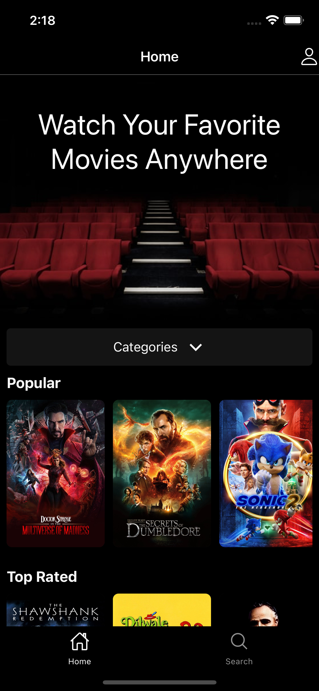

# Movie mobile app

This is a cross-platform movie streaming mobile application for IOS and ANDROID built with React Native.

## Links

- [User Stories](#user-stories)
<!-- - [Introduction](#Introduction) -->
<!-- - [How to run the app](#how-to-run-the-app) -->
- [Usage](#usage)
- [Technologies](#technologies)

<!-- ## Introduction -->

<!-- Intro... -->

<!-- ## How to run the app 

NOTE you need special tools to run this app. -->

## User Stories
     
   - A User can watch movies.
   - A user can filter movies by categories.
   - A user can search for movies by movie title.
   - A user can find more information about the movie.
   - A user can save the movie to the "Watch Later" list.
   - A user can create an account.
   - A user can log into the account.
   - A user can update account information.
   - A user can delete account.
 

## Usage

1. Home Screen

   - To open the home screen, tap the "Home" icon on the bottom navigation tab. You will find the most popular, upcoming, and top-rated movies here.
   - To watch or learn more about the movie, tap the movie poster.
   - Tap the "Categories" tab to select the category of the movie you want to watch.

      
     
     

2. Search movie

   - Tap the "Search" icon on the bottom tab and a new screen will open with a search bar at the very top. 
   - Enter the title of your favorite movie and list of movies will be displayed below the search bar.
   - To watch or learn more about the movie, tap the movie poster.

3. Movie

   - Tap the play/pause button or anywhere in the video area to play/pause the movie.
   - To save the movie to the "Watch Later" list, tap the "My List" button.
   - To remove a movie from the list, click the "Saved" button.
   
    
   
4. Profile

   - To navigate to your Profile, tap the person icon in the top right corner.
   - To find your saved movies, tap the "My List" button and a new screen will open with your saved movies.
   - To find your account details, tap the "Account" button and a new screen will open with your account details if you are logged in.

5. Login

   - Tap the person icon in the top right corner, then tap the "Account" button. A new screen will open with a login form.
   - Fill out the form and tap the "Login" button to log into your account. A new screen will open with your account details.

6. Create account.

   - Tap the person icon in the top right corner, then tap the "Account" button. A new screen will open with a login form.
   - Tap the "Create a new user" button at the bottom to switch to the signup form.
   - Fill out the form and tap the "Signup" button to create a new account.

7. Manage account

   - To update your account information, tap the person icon in the top right corner.
   - To update any of your account information, tap the pencil icon, enter your new data, and tap Save changes. (You may be asked to re-enter your password).
   - To log out of your account, click the "Sign out" button.
   - To delete your account, tap the "Delete my account" button, re-enter your password, and tap Delete button.
   

## Technologies

   - react v17.0.2
   - react-native v0.68.2
   - firebase v9.6.11
